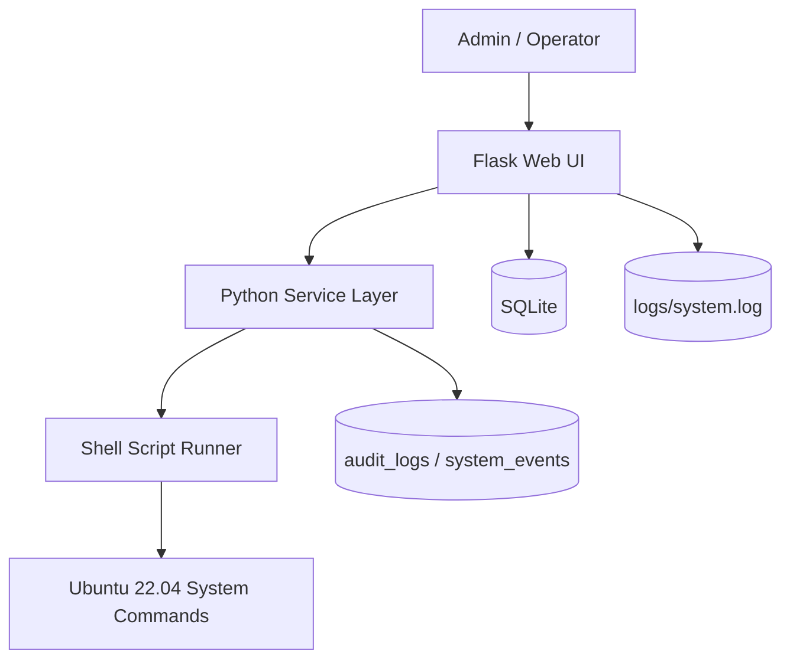
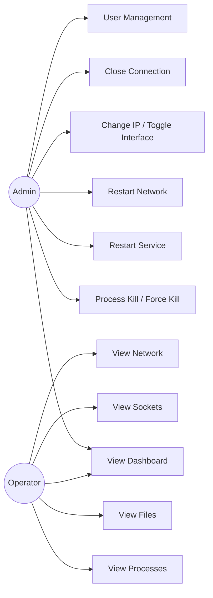
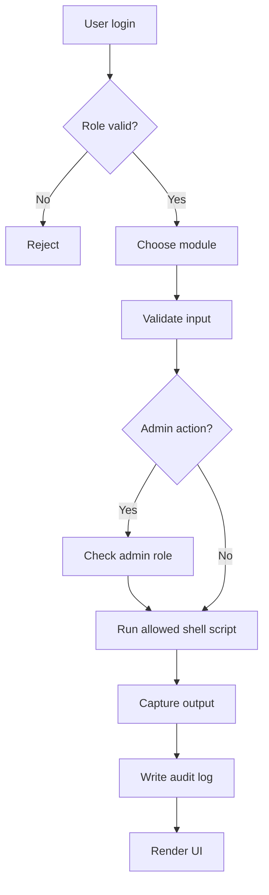

# Architecture

## 1. Tổng thể hệ thống



## 2. Use Case Diagram



## 3. Activity Diagram



## 4. Database Design

- `users(id, username, password_hash, full_name, is_active, role_id, created_at, updated_at)`
- `roles(id, name, description, created_at)`
- `audit_logs(id, username, action, module, timestamp, result, details)`
- `system_events(id, event_type, target, module, message, created_at)`

## 5. Cấu trúc thư mục

```text
app/
  blueprints/
  services/
  utils/
  templates/
  static/
scripts/
docs/
instance/
logs/
```

## 6. Hướng dẫn triển khai Ubuntu 22.04

1. Cài đặt Python 3.12, Bash utilities, `lsof`, `ss`, `iproute2`, `netcat`, `inotify-tools`, `traceroute`.
2. Tạo virtualenv và cài dependencies.
3. Khởi tạo database với `python manage.py init-db`.
4. Chạy ứng dụng bằng `python wsgi.py` hoặc `gunicorn`.
5. Đảm bảo thư mục `logs/` và `instance/` có quyền ghi.

## 7. sudo cho ứng dụng

Tạo file sudoers riêng, ví dụ `/etc/sudoers.d/ubuntu-monitor`:

```text
ubuntu-monitor ALL=(root) NOPASSWD: /bin/systemctl restart NetworkManager, /bin/systemctl restart networking
ubuntu-monitor ALL=(root) NOPASSWD: /bin/ip link set *, /bin/ip addr flush *, /bin/ip addr add *, /bin/ip route replace *
ubuntu-monitor ALL=(root) NOPASSWD: /bin/kill, /usr/bin/pkill
```

Khuyến nghị chạy Flask dưới user riêng `ubuntu-monitor` và chỉ cấp đúng lệnh cần thiết.

## 8. Kiểm thử hệ thống

- Login / logout với Admin và Operator.
- View process list / detail / search.
- Thử kill, force kill, restart service bằng Admin.
- Kiểm tra file monitoring, socket, network functions.
- Xác nhận audit log xuất hiện trong `logs/system.log` và SQLite.
- Kiểm tra command injection bằng input có ký tự lạ, phải bị từ chối.

## 9. Notes

- Shell scripts chỉ thực thi lệnh đã định nghĩa trước.
- Flask không nhận lệnh Linux tùy ý từ UI.
- Giao diện dùng Bootstrap 5 và Chart.js với auto refresh 5 giây.
