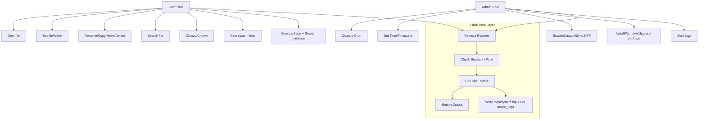

# Linux Administration Dashboard

Linux Administration Dashboard duoc xay dung theo mo hinh Flask + Shell Script:
- Python chi xu ly Web UI, request/response, auth, logging, va goi shell script qua subprocess.
- Shell script thuc thi cac lenh Linux thuc te.

## 1. Thiet Ke Kien Truc He Thong

### Kien truc 3 lop
1. Frontend Layer
- HTML5 + Bootstrap 5 + JavaScript
- Cac trang: Login, Dashboard, File Management, Task Scheduler, System Time, Package Management, Logs

2. Backend Layer (Python 3.12)
- Flask route/controller
- Flask-SQLAlchemy + SQLite
- Session auth, role-based access control (Admin/User)
- subprocess de goi cac script trong thu muc scripts/
- Logging vao logs/system.log va bang action_logs

3. System Layer (Shell Script)
- scripts/*.sh
- Chua cac lenh Linux cho file, cron, time, package

## 2. Cau Truc Thu Muc Du An

```text
Kernel-Linux/
|-- app.py
|-- requirements.txt
|-- Dockerfile
|-- docker-compose.yml
|-- .env.example
|-- .gitignore
|-- README.md
|-- scripts/
|   |-- list_files.sh
|   |-- create_file.sh
|   |-- create_folder.sh
|   |-- rename_file.sh
|   |-- copy_file.sh
|   |-- move_file.sh
|   |-- delete_file.sh
|   |-- search_file.sh
|   |-- chmod_file.sh
|   |-- chown_file.sh
|   |-- list_cron.sh
|   |-- create_cron.sh
|   |-- update_cron.sh
|   |-- delete_cron.sh
|   |-- run_job.sh
|   |-- show_time.sh
|   |-- set_time.sh
|   |-- set_timezone.sh
|   |-- enable_ntp.sh
|   |-- disable_ntp.sh
|   |-- sync_time.sh
|   |-- list_packages.sh
|   |-- search_package.sh
|   |-- install_package.sh
|   |-- remove_package.sh
|   |-- upgrade_package.sh
|-- templates/
|   |-- base.html
|   |-- login.html
|   |-- index.html
|   |-- file_management.html
|   |-- task_scheduler.html
|   |-- system_time.html
|   |-- package_management.html
|   |-- logs.html
|-- static/
|   `-- js/app.js
|-- logs/
|   `-- system.log
`-- instance/
    `-- dashboard.db (auto create)
```

## 3. Database Schema

### Bang users
```sql
CREATE TABLE users (
    id INTEGER PRIMARY KEY AUTOINCREMENT,
    username VARCHAR(64) UNIQUE NOT NULL,
    password_hash VARCHAR(255) NOT NULL,
    role VARCHAR(16) NOT NULL DEFAULT 'user',
    created_at DATETIME NOT NULL
);
```

### Bang action_logs
```sql
CREATE TABLE action_logs (
    id INTEGER PRIMARY KEY AUTOINCREMENT,
    username VARCHAR(64) NOT NULL,
    action VARCHAR(255) NOT NULL,
    result VARCHAR(32) NOT NULL,
    detail TEXT NOT NULL,
    created_at DATETIME NOT NULL
);
```

## 4. Use Case Diagram



## 5. Source Code Flask
- File chinh: app.py
- Da bao gom:
  - Login/Logout/Session
  - Role Admin/User
  - Module routes
  - subprocess shell execution
  - Logging file + DB

## 6. Toan Bo Shell Script
- Nam trong thu muc scripts/
- Da co du 4 module theo yeu cau de bai.

## 7. Giao Dien Bootstrap
- Bootstrap 5 responsive
- Form theo tung module
- Hien thi output command tren web
- Confirm cho thao tac nguy hiem (delete/remove)

## 8. Dockerfile
- Da cung cap file Dockerfile o root project.

## 9. docker-compose.yml
- Da cung cap file docker-compose.yml o root project.

## 10. Huong Dan Trien Khai Ubuntu 22.04

### Cach A: Chay tren host Ubuntu (khuyen nghi cho Linux admin that)

1. Cai goi he thong:
```bash
sudo apt update
sudo apt install -y python3.12 python3.12-venv python3-pip
```

2. Tao virtual env va cai dependency:
```bash
cd /home/pvd/Desktop/Kernel-Linux
python3.12 -m venv .venv
source .venv/bin/activate
pip install -r requirements.txt
chmod +x scripts/*.sh
```

3. Cau hinh bien moi truong:
```bash
cp .env.example .env
export $(grep -v '^#' .env | xargs)
```

4. Chay app:
```bash
python app.py
```

5. Truy cap:
- http://localhost:5000
- Admin: admin / admin123
- User: user / user123

### Cach B: Chay bang Docker

```bash
cd /home/pvd/Desktop/Kernel-Linux
docker compose up --build
```

Luu y khi chay Docker:
- Cac lenh quan tri (time, apt, cron) tac dong chu yeu ben trong container.
- Neu can quan tri host Ubuntu that, nen chay Cach A tren host va cap quyen sudo/root phu hop.

## Security Da Ap Dung
- Login + Session
- Role-based authorization
- Admin-only:
  - Task Scheduler
  - Set time/timezone/NTP/sync
  - Install/Remove/Upgrade package
- Audit log:
  - logs/system.log
  - bang action_logs

## Logging Format

Mau trong logs/system.log:
```text
2026-06-11 21:00:00 | user=admin | action=packages:install | result=SUCCESS | detail=Package installed: htop
```
